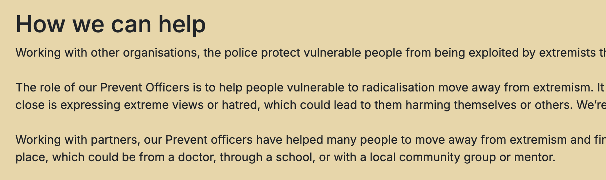
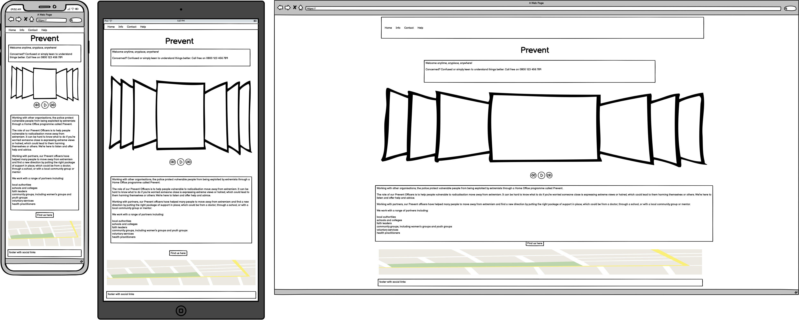
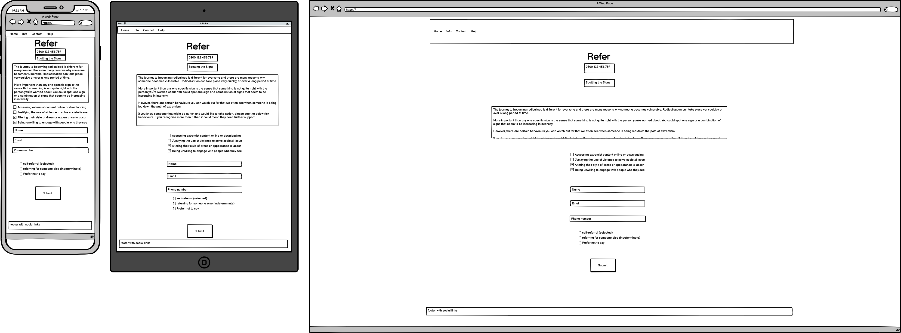
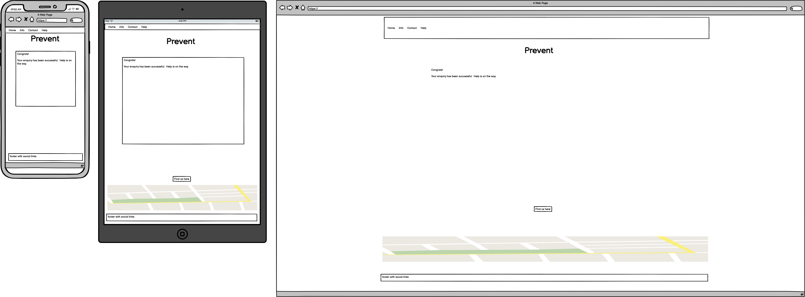

# Prevent

This project is a basic introduction to the Prevent strategy, including how to recognise signs of radicalisation and how to report concerns presented in a simple, easy-to-navigate format.

The main goal is to create an informative webpage that introduces the Prevent strategy. The content should be well-organised and easy to digest, with a focus on simplicity and clarity through the use of HTML and CSS with Bootstrap.

Visit the deloyed site here: [Visit Prevent](https://jamesfowler-dev.github.io/flagstone-project-/)

## Contents

-   User Experience

    -   User Stories

-   Design

    -   Color Scheme
    -   Typography
    -   Imagery
    -   Wireframes
    -   Features
    -   Accessibility

-   Technologies Used
    -   Languages
    -   Frameworks, Libraries & Programs

## User Experience (UX)

### User Stories

## Design

### Color Scheme

My primary focus was to keep the colour scheme used on the site calming and pleasing to view so as to not overwhelm users or making it tiring to read. Warm browns and cream colors were used throughout.

In my css file I have used variables to declare colours and then used these throughout the css file.

-   Primary color: #ebd5a4
-   Secondary color: #c29765
-   Darker higherlight color: #441f05

### Typography

Google Fonts was used to import the chosen fonts for use in the site.

-   I have chosen the font stack: "Inter", "Helvetica Neue", Arial, sans-serif. I wanted font that was highly accessible and widely used across browsers but that also looked clean and easy-to-read. The sites purpose was to inform so the right font was a critical part of the design.

### Imagery

### Wireframes

Wireframes were created for mobile, tablet and desktop using balsamiq:

## Features

The website is comprised of a home page, a referral page, a support page and a success page.

All Pages on the website are responsive and have:

A favicon in the browser tab.

## Technologies Used

### Languages Used

HTML, CSS, Javascript

## Frameworks, Libraries & Programs Used

-   Balsamiq - used to create the wireframes
-   Git - for version control
-   Github - To save and store the files for the website
-   VS-Code - IDE used to create the site
-   Google Fonts - To import the fonts used on the website
-   Bootstrap 5 - used to import the carousel and navbar elements
-   Google Developer Tools - To troubleshoot and test features, solve issues with responsiveness and styling
-   TinyPNG - to compress images
-   Photopea - to resize images
-   Favicon.io - to create the favicon
-   Unsplash - to create the images used in the site
-   Co-Pilot - used to troubleshoot minor issues and provide reminders for correct syntax

## Deployment

### Deployment

The site is deployed using GitHub Pages - [Visit Prevent](https://jamesfowler-dev.github.io/flagstone-project-/)

## Testing

## Credits

### Acknowledgments
