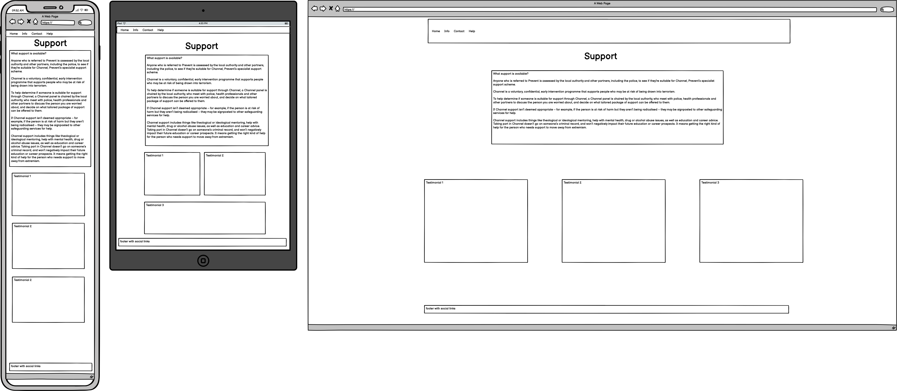
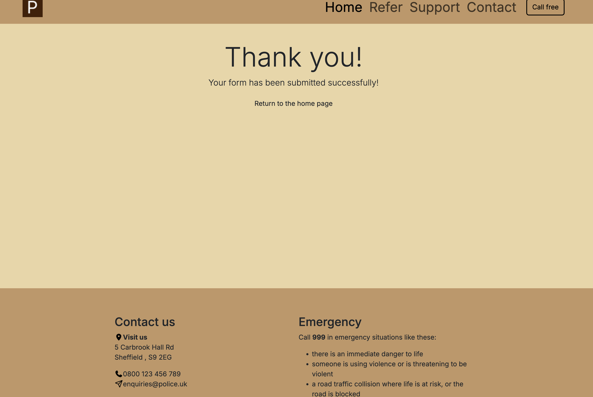
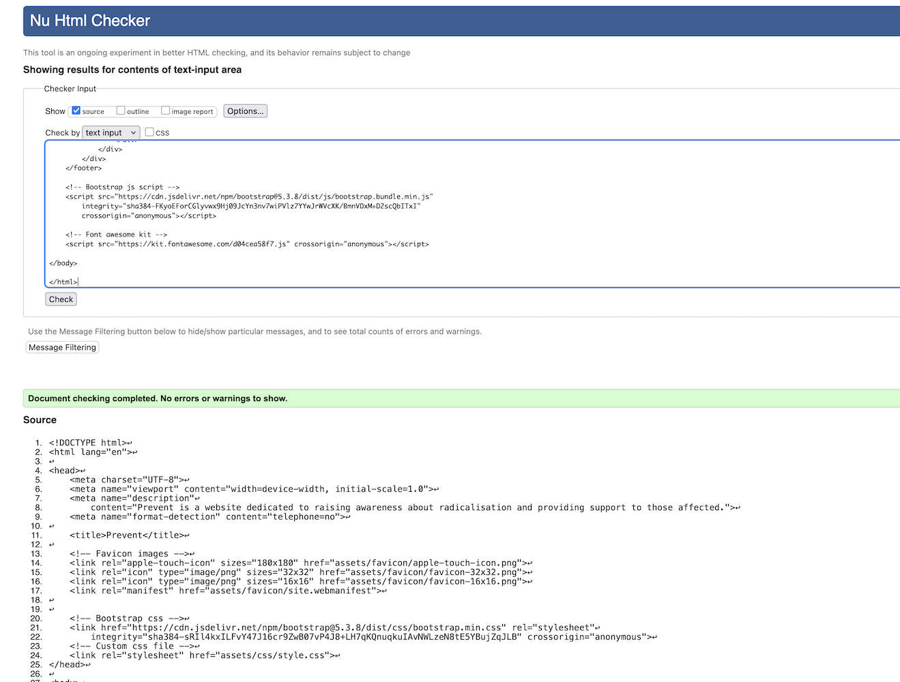
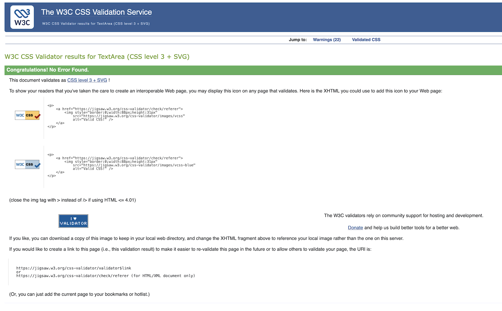
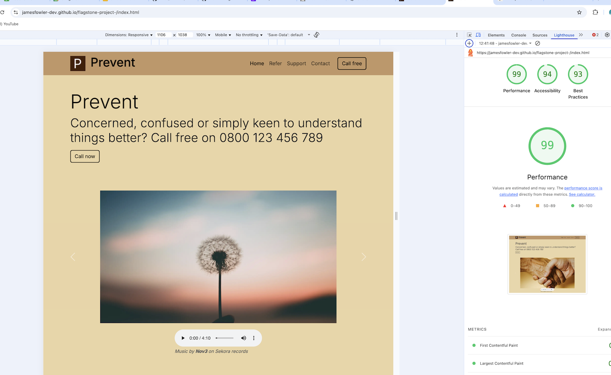

# Prevent

This project is a basic introduction to the [Prevent Strategy](https://assets.publishing.service.gov.uk/media/5a78966aed915d07d35b0dcc/prevent-strategy-review.pdf), including how to recognise signs of radicalisation and how to report concerns presented in a simple, easy-to-navigate format.

The main goal is to create an informative webpage that introduces the Prevent strategy. The content should be well-organised and easy to digest, with a focus on simplicity and clarity through the use of HTML and CSS with Bootstrap.

Visit the deloyed site here: [Visit Prevent](https://jamesfowler-dev.github.io/flagstone-project-/)

## Contents

-   [User Experience](#user-experience)

    -   [User Stories](#user-stories)

-   [Design](#design)

    -   [Color Scheme](#color-scheme)
    -   [Typography](#typography)
    -   [Imagery](#imagery)
    -   [Wireframes](#wireframes)
    -   [Features](#features)
    -   [Accessibility](#accessibility)

-   [Technologies Used](#technologies-used)

    -   [Languages](#languages-used)
    -   [Frameworks, Libraries & Programs](#frameworks-libraries--programs-used)
    -   [AI Implementation](#ai-implementation)

-   [Deployment](#deployment)
-   [Testing](#testing)
-   [Credits](#credits)
-   [Acknowledgements](#acknowledgments)

## User Experience (UX)

### User Stories

### The At-risk individual

As someone struggling with extremist views, I want to find non-judgmental support so that I can change my thinking. As a young person, I want to find stories of others who got help so that I don’t feel alone.

### The Parent

As a parent I want to understand what radicalisation is so that I can talk to my child about it. As a concerned guardian, I want to know the signs of online grooming or radical content so that I can protect my child. As a family member, I want to know who to contact if I’m worried about someone I love being radicalised. As a member of the public, I want to report suspicious behaviour anonymously so that I can help prevent violence.

### The Teacher/Educator

As a Teacher/educator, I want easy access on all devices to resources so that I can identify signs of radicalisation in students. I want to easily know how to make a Prevent referral so that I can act quickly if I’m concerned about a student.

I worked through the user stories to identiyy acceptance criteria and specific tasks required:

## Design

### Color Scheme

My primary focus was to keep the colour scheme used on the site calming and pleasing to view so as to not overwhelm users or making it tiring to read. Warm browns and cream colors were used throughout.

In my css file I have used variables to declare colours and then used these throughout the css file.

-   Primary color: #ebd5a4
-   Secondary color: #c29765
-   Darker higherlight color: #441f05

### Typography

Google Fonts was used to import the chosen fonts for use in the site.

-   I have chosen the font stack: "Inter", "Helvetica Neue", Arial, sans-serif. I wanted font that was highly accessible and widely used across browsers but that also looked clean and easy-to-read. The sites purpose was to inform so the right font was a critical part of the design.

### Imagery

It was important that the website was a pleasent place to visit and so I wanted to use images that were calming and optimistic accompanied with uplidting music. This was to try and convey that there is always a way to take action and build a brighter future. I tried to avoid the clinical and cold blues and greys which make encourage the user to leave the website.

### Wireframes

Wireframes were created for mobile, tablet and desktop using balsamiq:

## Features

The website is comprised of a home page, a referral page, a support page and a success page.

All Pages on the website are responsive and have:

-   A favicon in the browser tab.

-   A header with navigation links and a direct call-to-action-button:

    

-   All pages are fully responsive:

### The Home Page

The home page is designed to be as welcoming as possible with clarity on what the programme is and how to access information or contact details as soon as possible. An outline of the strategy and what it is is below the main carousel.

-   The home page specifically has a carousel with controls:

    

-   Audio controls:

    

### The Refer Page

The idea behind the refer page was if someone wanted to either flag an at-risk individual to authorities or if you yourself wanted to seek help. As such, the name input for the form is optional.

-   The risk profile

-   The referral form

### The Support Page

The Support Page is about providing a link to further information and support. The testimonials were to show that the programme is effective for all situations.

-   The testimonial cards are part of a grid and react responsively.

### The Success Page

A link is available to bring you back to the home page.

### Future Implementations

With more time I would be keen to:

-   add more JavaScript functionality and include a local police search in the footer section.
-   include an AI Assistant that could be able to provide real-time chat functionality.
-   include videos to articulate the different sections more vividly.

## Accessibility

I have been mindful to ensure that the website is as accessible to as many users as possible. This has been have achieved by:

-   Using semantic HTML
-   Using a hover state on all call-to-action buttons on the site
-   Increasing the navbar links font-size to ensure satisfactory contrast-ratio
-   Choosing a widely available font stack
-   Ensureing every image has an appropriate alt description and aria description where possible

## Technologies Used

### Languages Used

HTML, CSS, Javascript

## Frameworks, Libraries & Programs Used

-   [Balsamiq](https://balsamiq.com/) - used to create the wireframes
-   [Git](https://git-scm.com/) - for version control
-   [Github](https://github.com/) - To save and store the files for the website
-   [VS-Code](https://code.visualstudio.com/) - IDE used to create the site
-   [Google Fonts](https://fonts.google.com/) - To import the fonts used on the website
-   [Bootstrap 5](https://getbootstrap.com/) - used to import the carousel and navbar elements
-   [Google Developer Tools](https://developer.chrome.com/docs/devtools) - To troubleshoot and test features, solve issues with responsiveness and styling
-   [TinyPNG](https://tinypng.com/) - to compress images
-   [Photopea](https://www.photopea.com/) - to resize images
-   [Favicon.io](https://favicon.io/) - to create the favicon
-   [Unsplash](https://unsplash.com/) - to create the images used in the site
-   [Co-Pilot](https://copilot.microsoft.com/) - used to troubleshoot minor issues and provide reminders for correct syntax
-   [ChatGPT](https://chatgpt.com/) - used to troubleshoot minor issues and provide reminders for correct syntax
-   [W3C HTML/CSS validation](https://validator.w3.org/) - validating CSS files
-   [Autoprefixer](https://autoprefixer.github.io/) - prefixing CSS
-   [Adobe Color](https://color.adobe.com/create/color-wheel) - used to find complimentory colors from image

## AI Implementation

Co-Pilot and ChatGPT were used to troubleshoot and suggest fixes for issues throughout. Typical use was sumple syntax reminders or attribute functions.

## Deployment

The site is deployed using GitHub Pages - [Visit Prevent](https://jamesfowler-dev.github.io/flagstone-project-/)

## Testing

All pages completed HTML/CSS validation checks:

All pages scored above 90% in Lighthouse reports:

### Known bugs

-   checkboxes are currently displaying as blue color. At the time of writing a fix was not possible in the time permitted.

## Credits

-   Nov3 for use of the track "Sea of Wonder" published on [Sekora music](https://sekoramusic.com/).

### Acknowledgments

I would like to acknowledge all the technical tutors at Code Institute for their support throughout this project.
